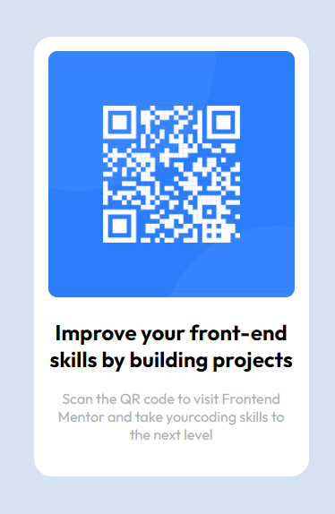

# Frontend Mentor - QR code component solution

This is a solution to the [QR code component challenge on Frontend Mentor](https://www.frontendmentor.io/challenges/qr-code-component-iux_sIO_H).

### Screenshot



### Links

-   Solution URL: [Add solution URL here](https://www.frontendmentor.io/solutions/qr-component-NWZNh1P_js)
-   Live Site URL: [Add live site URL here](https://chris-wagg.github.io/QR-code-component/)

## Getting Started

First, run the development server:

```bash
npm run dev
# or
yarn dev
# or
pnpm dev
# or
bun dev
```

Open [http://localhost:3000](http://localhost:3000) with your browser to see the result.
